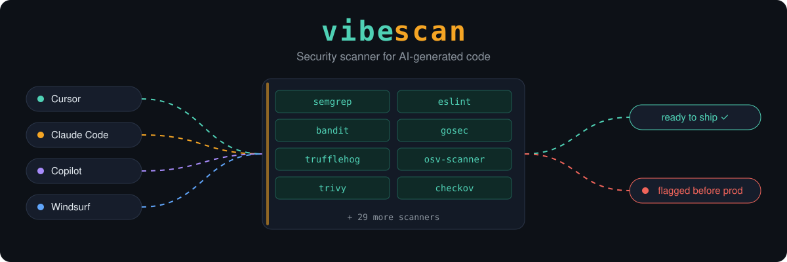
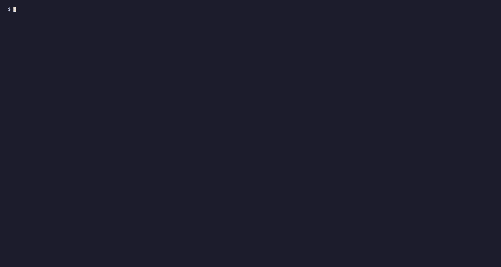
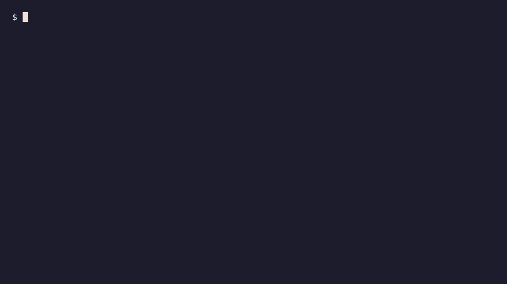

<div align="center">

<picture>
  <source media="(prefers-color-scheme: dark)" srcset="banner/vibescan-dark.svg">
  <source media="(prefers-color-scheme: light)" srcset="banner/vibescan-light.svg">
  
</picture>

# vibescan

### The open-source security scanner for AI-generated code

**Find vulnerabilities in Cursor, Claude Code, Copilot and Windsurf generated applications before they reach production.**

[](LICENSE)
[](https://golang.org)
[](https://github.com/Armur-Ai/vibescan)
[](https://discord.gg/PEycrqvd)

[Why](#why) &bull; [What it catches](#what-it-catches) &bull; [Quick start](#quick-start) &bull; [Scanners](#scanners) &bull; [Status](#project-status) &bull; [Roadmap](#roadmap) &bull; [Contributing](#contributing)

</div>

---

<div align="center">

</div>

## Why

AI assistants write code that compiles, runs, and demos well. Whether it is safe is a separate question, and the numbers are not improving.

- **56%.** The security pass rate of AI-generated code across 100+ models, unchanged in a year. ([Veracode 2026 GenAI Code Security Report](https://www.veracode.com/news/llms-are-getting-smarter-but-not-safer-veracode-2026-genai-code-security-report-finds-ai-generated-code-security-has-stalled-at-56%25-pass-rate/))
- **1.7x.** How many more issues AI co-authored pull requests carry than human-only ones. ([CodeRabbit, 470 open-source PRs](https://www.coderabbit.ai/blog/state-of-ai-vs-human-code-generation-report))
- **19.7%.** The share of packages recommended by code models that do not exist, waiting to be registered by an attacker. ([USENIX Security 2025](https://www.usenix.org/conference/usenixsecurity25/presentation/spracklen))

The mistakes are repetitive: a service key in the browser bundle, a database table anyone can read, an API route with no login check, a dependency that was never real. Traditional scanners were built for a different kind of code and a different kind of team.

vibescan is built for this kind: it runs the best open-source scanners behind one command, and it is growing a rule set aimed at what AI tools actually get wrong.

## What it catches

We organise findings around the **Vibe Top 10**, the failure modes that show up again and again in AI-generated applications. This table is honest about where detection stands today.

| | Failure mode | Typical AI-generated form | Today |
|---|---|---|---|
| **V01** | Secrets shipped to the client | Service-role key behind `NEXT_PUBLIC_`; API keys in the bundle | Partial: hardcoded credentials in source |
| **V02** | Missing or client-only authorization | API routes and server actions with no session check; IDOR | Planned |
| **V03** | Open data layer | Supabase tables without RLS; Firebase rules of `if true` | Planned |
| **V04** | Hallucinated and risky dependencies | Packages that do not exist, are brand new, or are malicious | Partial: known CVEs, in the deep pass |
| **V05** | String-built injection | SQL, shell, SSRF and XSS built by concatenating user input | **Yes**: command injection, XSS, `eval`; SQL injection in Python |
| **V06** | Placeholder security | `JWT_SECRET = "secret"`, `admin`/`admin`, wildcard CORS | Partial: hardcoded credentials |
| **V07** | Unverified webhooks and payments | Stripe webhook without signature check | Planned |
| **V08** | Missing abuse controls | No rate limiting on login or LLM endpoints | Planned |
| **V09** | Unsafe LLM integration | User input in system prompts; model output passed to `eval` | Partial: `eval` of request-derived data |
| **V10** | Poisoned agent context | Hidden instructions in `.cursorrules` or `CLAUDE.md`; unpinned MCP servers | Planned |

Against our own reference target, [`examples/vibe-coded-app`](examples/vibe-coded-app), today's scan reports the command injection, the XSS, the `eval`, and the hardcoded credentials. It does not yet report the SQL injection in the JavaScript, the SSRF, the missing authorization, the exposed Supabase key, or the table without row-level security. Closing that gap is what the [roadmap](ROADMAP.md) is about.

## Quick start

vibescan is pre-release. There are no published packages yet, so you build it from source. You need Docker and Go 1.25 or newer.

```bash
git clone https://github.com/Armur-Ai/vibescan
cd vibescan

# 1. Start the scan engine (first build takes a few minutes)
docker compose up -d --build

# 2. Build the CLI
(cd cli && go build -o ../bin/vibescan .)

# 3. Scan a file
./bin/vibescan scan examples/vibe-coded-app/server.js

# 4. Or scan a repository
./bin/vibescan scan https://github.com/you/your-app -l js
```

Languages for `-l`: `go`, `py`, `js`, `rust`, `java`, `ruby`, `php`, `c`, `iac`, `sol`.

Useful flags:

```bash
./bin/vibescan scan <repo-url> -l js --advanced          # deep pass: dependencies, IaC, duplication, dead code
./bin/vibescan scan <target> --output json               # machine-readable results
./bin/vibescan scan <target> --fail-on-severity high     # non-zero exit for CI
```

Running `./bin/vibescan` with no arguments opens the interactive menu:

<div align="center">

</div>

> **Do not run `pip install vibescan`.** That name on PyPI belongs to an unrelated project. An earlier version of this README listed it by mistake.

### Using the API directly

The engine is a REST service on port 4500.

```bash
# Scan a repository
curl -X POST http://localhost:4500/api/v1/scan/repo \
  -H "Content-Type: application/json" \
  -d '{"repository_url": "https://github.com/you/your-app", "language": "js"}'

# Scan a single file
curl -X POST http://localhost:4500/api/v1/scan/file -F "file=@app.py"

# Fetch results (add ?format=sarif for SARIF 2.1.0)
curl http://localhost:4500/api/v1/status/<task_id>
```

Interactive API docs are served at `http://localhost:4500/swagger/index.html`.

## Scanners

vibescan does not reinvent static analysis. It orchestrates established open-source scanners in parallel, normalises severities, maps findings to CWEs, and returns one report.

| Target | Standard scan | Deep pass (`--advanced`) |
|---|---|---|
| **JavaScript / TypeScript** | Semgrep, ESLint (security rules) | ESLint (dead code) |
| **Python** | Semgrep, Bandit, Pylint, Radon, pydocstyle | Vulture |
| **Go** | Semgrep, gosec, staticcheck, go vet, gocyclo | deadcode |
| **Rust** | Semgrep, cargo-audit, cargo-geiger, Clippy | |
| **Java / Kotlin** | Semgrep, SpotBugs, PMD, OWASP Dependency-Check | |
| **Ruby** | Semgrep, Brakeman, bundler-audit | |
| **PHP** | Semgrep, PHPCS, Psalm | |
| **C / C++** | Semgrep, Cppcheck, Flawfinder | |
| **Solidity** | Semgrep, Slither, Mythril | |
| **Infrastructure as code** | Semgrep, Hadolint, tfsec, KICS, kube-linter, kube-score | |
| **Every language** | | Trivy, OSV-Scanner, Checkov, TruffleHog, jscpd |

The deep pass is a separate run for repositories: it reports dependency, infrastructure, duplication and dead-code findings, and does not repeat the standard scan.

The Docker image ships the JavaScript, Python and Go scanners plus Trivy, OSV-Scanner and Checkov. TruffleHog and the scanners for other languages run when their binary is on the engine's `PATH`; a missing tool is skipped and never fails the scan.

Coming next, in order: Gitleaks and validated secret detection, hallucinated-dependency checks, Supabase and Firebase rule analysis, route authorization checks for Next.js and Express, and scanning of agent config files. The full list of tools we plan to add is in the [scanner expansion plan](ROADMAP.md#8-scanner-expansion-plan).

## Project status

| Area | State |
|---|---|
| Scan engine: parallel scanners, severity normalisation, CWE mapping, SARIF | Working |
| Repository and single-file scans through the CLI and the API | Working |
| Interactive terminal menu | Working |
| Scanning a local directory from the CLI | Not yet. Scan a repository URL or a file. |
| Published packages (Homebrew, npm, install script) | Not yet. Build from source. |
| GitHub Action and pre-commit hook | Not yet. The files in this repo predate the rename and do not work. |
| MCP server for Claude Code, Cursor and Windsurf | Implemented in `internal/mcp`, not yet wired to the CLI |
| AI explanations and fixes, PR review | Implemented as packages, not yet wired to the CLI |
| Sandboxed DAST, exploit simulation, attack paths | Implemented as packages, not yet wired. Returning as verification of static findings. |

If something in this README does not work as written, that is a bug. Please [open an issue](https://github.com/Armur-Ai/vibescan/issues).

## Roadmap

The plan is in [ROADMAP.md](ROADMAP.md). In short:

| Phase | Goal |
|---|---|
| **0. Make the promise true** | One binary, no Redis, no Docker. `npx vibescan scan .` on a clean machine in under a minute. |
| **1. Vibe-native detection** | Our own analyzers for the Vibe Top 10: exposed keys, open Supabase and Firebase data, missing authorization, hallucinated dependencies. |
| **2. In the agent loop** | A working MCP server, editor hooks, and fix prompts, so the agent that wrote the bug fixes it. Scanning of rules files and MCP configs. |
| **3. Scanner breadth** | Opengrep, Gitleaks, GuardDog, zizmor, Ruff and more, each with a fixture that proves it fires. |
| **4. Proof and distribution** | A public benchmark of what each AI coding tool generates, a GitHub Action, PR review, and a web scan. |
| **5. Runtime verification** | Probe deployed apps you own, and confirm static findings in a sandbox. |

## Contributing

The most useful contributions right now:

- **A vulnerable snippet an AI tool gave you.** Open an issue with the code and which tool wrote it. These become fixtures and rules.
- **Any of the [first ten tasks](ROADMAP.md#13-the-first-ten-tasks).**
- **A scanner from the [expansion plan](ROADMAP.md#8-scanner-expansion-plan)**, wired in with a fixture.

Run the tests with `go test ./...` from the repo root and from `cli/`.

## Security

Found a vulnerability in vibescan itself? See [SECURITY.md](SECURITY.md).

## Credits

vibescan stands on the work of the projects it runs:
[Semgrep](https://github.com/semgrep/semgrep),
[Trivy](https://github.com/aquasecurity/trivy),
[OSV-Scanner](https://github.com/google/osv-scanner),
[gosec](https://github.com/securego/gosec),
[Bandit](https://github.com/PyCQA/bandit),
[ESLint](https://github.com/eslint/eslint),
[Checkov](https://github.com/bridgecrewio/checkov),
[TruffleHog](https://github.com/trufflesecurity/trufflehog),
[Brakeman](https://github.com/presidentbeef/brakeman),
[Slither](https://github.com/crytic/slither),
and the [rest of the pipeline](#scanners). If vibescan finds something for you, one of them probably did the hard part.

## License

MIT. See [LICENSE](LICENSE).

---

<div align="center">

[Roadmap](ROADMAP.md) &bull; [Discord](https://discord.gg/PEycrqvd) &bull; [Issues](https://github.com/Armur-Ai/vibescan/issues)

*AI wrote it. vibescan checks it.*

</div>
